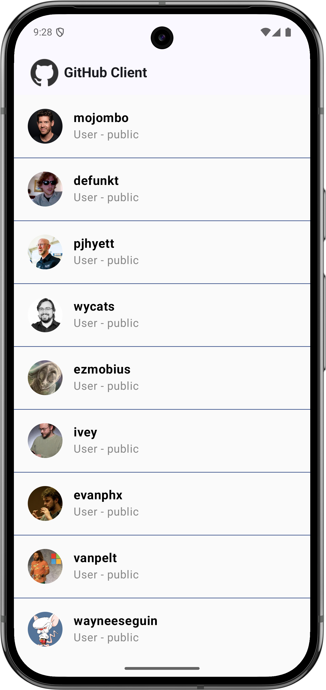
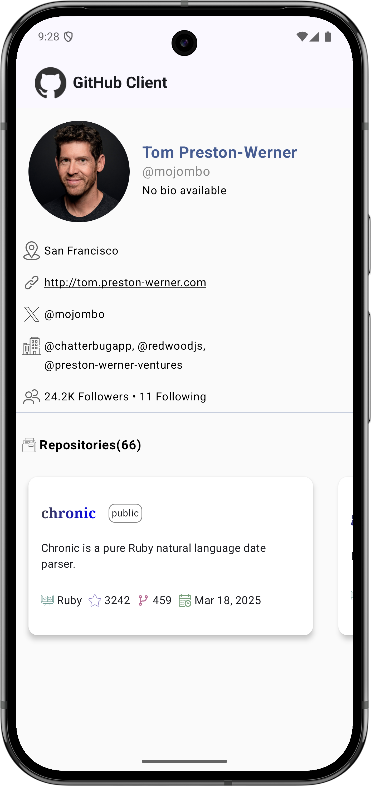

# Android GitHub User Viewer

This Android App Allows users to view GitHub user profiles and their repos.
The app is built with Kotlin, Jetpack Compose, and follows the MVVM architecture with Hilt for dependency injection.


## Features

- List of GitHub Users: Displays a list of GitHub users.
- Detailed View of Individual GitHub User Profiles and Repositories: Provides detailed information about individual GitHub users, including their repositories.

## Technologies Used
- Kotlin
- Android Jetpack Compose
- Hilt for dependency injection
- MVVM Architecture

## Screenshots

### List View

The list view displays a list of GitHub users with their avatars and usernames.



### Detailed View

The detailed view shows individual GitHub user profiles, including their name, bio, number of followers, and repositories.



### Improvements

1. **Performance Optimization**
   - Implement pagination for the list view to load users incrementally.
   - Use caching mechanisms to store previously fetched data.

2. **UI/UX Enhancements**
   - Add animations for transitions and loading states.
   - Improve error handling with user-friendly messages and retry options.

3. **Accessibility**
   - Ensure all interactive elements have appropriate content descriptions.
   - Support dynamic font scaling.

### Additional Features

1. **Search Functionality**
   - Add a search bar to allow users to find specific GitHub users.

2. **Favorites**
   - Allow users to mark profiles or repositories as favorites and view them in a dedicated section.

3. **User Authentication**
   - Implement GitHub OAuth for personalized data access.

4. **Repository Details**
   - Enhance detailed views with more information about repositories, such as issues and pull requests.

## Installation

To install and run this application, follow these steps:

1. Clone the repository:
   ```bash
   git clone https://github.com/AthaniMS/GitHubClient.git
   
   ```

2. Open the project in Android Studio.

3. Build and run the project on an emulator or a physical device.

## Usage

1. Open the app to view a list of GitHub users.
2. Tap on any user to view their detailed profile and repositories.
